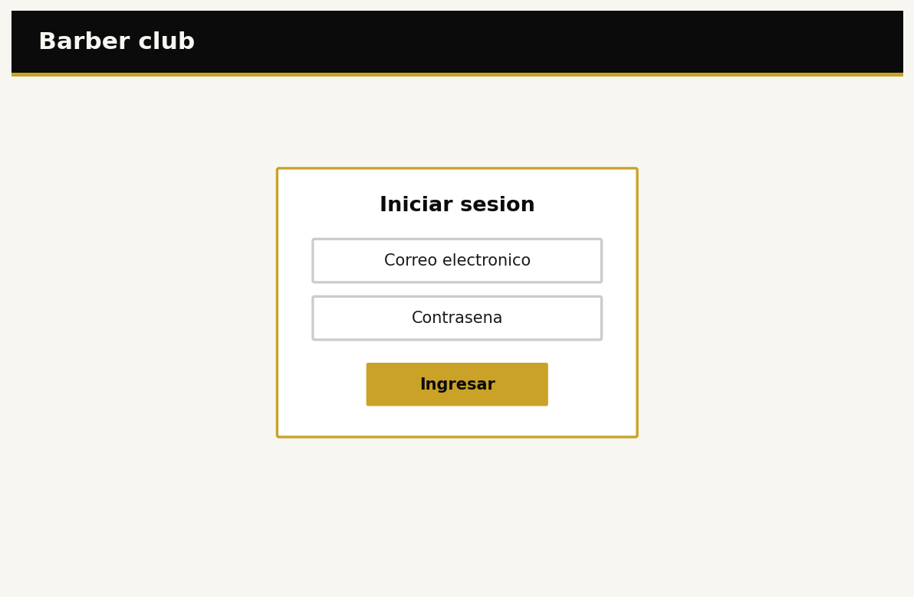
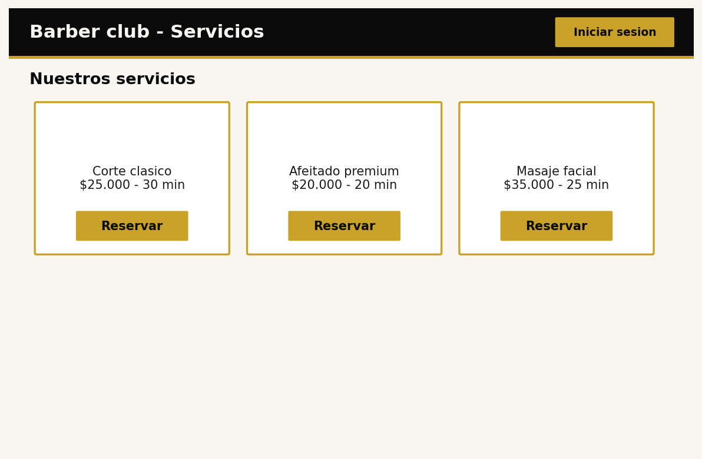
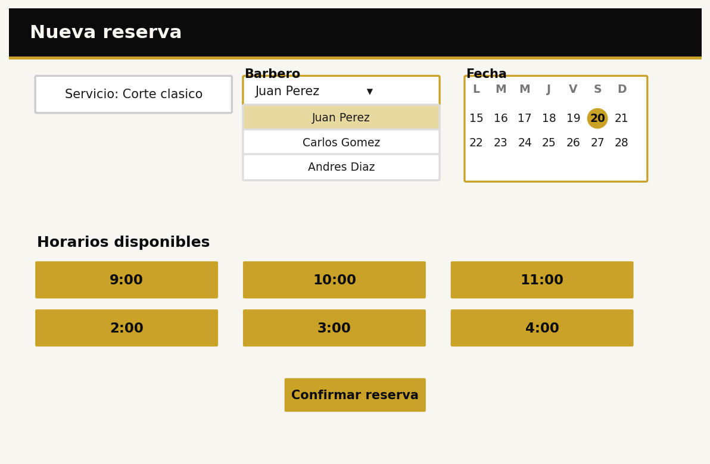
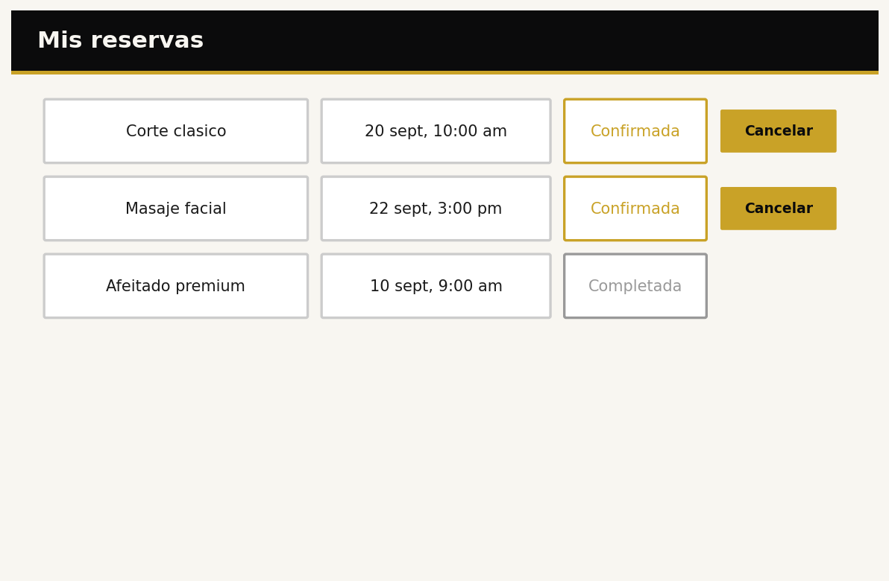
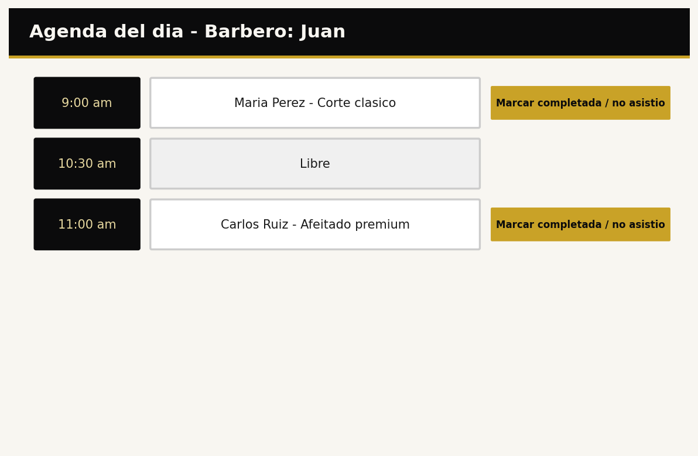
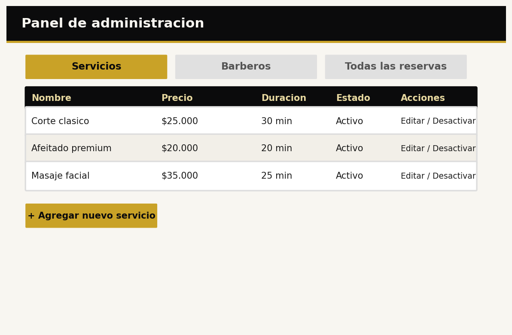

# Definición del proyecto: Barber club

Programación Web (IF2003), grupo 603. Equipo 05.

## 1. Descripción general

Barber club es una plataforma web para que los clientes de una barbería reserven su cita en línea, eligiendo el servicio, el barbero, la fecha y la hora que prefieran, sin necesidad de llamar o desplazarse hasta el local. Los barberos consultan su agenda del día directamente en la plataforma y marcan sus citas como completadas o no asistidas. El administrador gestiona los servicios que ofrece la barbería, los barberos disponibles y tiene visibilidad completa sobre todas las reservas del negocio.

## 2. Problema

Actualmente las citas de la barbería se agendan por teléfono o WhatsApp, escribiendo el nombre del cliente en una libreta o dejándolo en el chat. Esto genera al menos dos problemas concretos: primero, se presentan cruces de horario porque dos personas distintas pueden agendar la misma hora con el mismo barbero sin que nadie lo note a tiempo; segundo, un cliente no tiene forma de saber qué horarios están disponibles sin llamar o ir en persona a preguntar.

## 3. Objetivos

**General:** permitir que un cliente reserve una cita en la barbería sin necesidad de llamar o desplazarse al local.

- Eliminar los cruces de horario: ningún barbero tiene dos citas confirmadas en el mismo horario.
- Permitir que un cliente complete una reserva en menos de dos minutos.

## 4. Stakeholders, actores y roles

- **Cliente** (rol): consulta servicios y disponibilidad, reserva una cita, ve y cancela sus propias reservas.
- **Barbero** (rol): consulta su agenda del día, marca sus citas como completadas o no asistidas.
- **Administrador** (rol): gestiona los servicios (crear, editar, desactivar), gestiona los barberos, y ve todas las reservas del negocio.
- **Dueño de la barbería** (stakeholder): no necesariamente usa la plataforma a diario, pero es el dueño del negocio que se beneficia de organizar las citas.
- **Login:** el cliente, el barbero y el administrador inician sesión con correo y contraseña. La lista de servicios es visible sin necesidad de iniciar sesión.

## 5. Alcance

**Incluye:** consulta de servicios y disponibilidad, reserva de citas por parte del cliente, cancelación de reservas propias, agenda del barbero, gestión de servicios y barberos por el administrador, inicio de sesión con tres roles.

**No incluye:** pagos en línea, notificaciones automáticas por mensaje de texto o correo, aplicación móvil nativa, sistema de reseñas o calificaciones, bloqueo de horarios por parte del barbero.

## 6. Funcionalidades

- **Cliente:** ver servicios y su disponibilidad, reservar una cita eligiendo servicio, barbero, fecha y hora, ver y cancelar sus propias reservas.
- **Barbero:** ver su agenda del día, marcar una cita como completada o no asistida.
- **Administrador:** crear, editar y desactivar servicios, crear y editar barberos, ver todas las reservas del negocio.

## 7. Requerimientos funcionales

| ID | Requerimiento | Rol | Prioridad |
|---|---|---|---|
| RF-01 | El sistema debe permitir reservar una cita indicando servicio, barbero, fecha y hora. | Cliente | Alta |
| RF-02 | El sistema no debe permitir dos citas confirmadas sobre el mismo barbero en el mismo horario. | Todos | Alta |
| RF-03 | El sistema debe permitir al barbero marcar una cita como completada o no asistida. | Barbero | Media |
| RF-04 | El sistema debe mostrar al cliente la lista de sus reservas activas y permitirle cancelarlas. | Cliente | Alta |
| RF-05 | El sistema debe permitir al administrador crear, editar y desactivar servicios. | Administrador | Alta |
| RF-06 | El sistema debe permitir al administrador crear y editar barberos. | Administrador | Media |
| RF-07 | El sistema debe permitir al administrador ver todas las reservas del negocio. | Administrador | Alta |

## 8. Requerimientos no funcionales

| ID | Categoría | Requerimiento |
|---|---|---|
| RNF-01 | Rendimiento | La lista de servicios y disponibilidad carga en menos de 2 segundos con conexión estable. |
| RNF-02 | Seguridad | Las contraseñas se guardan cifradas, nunca en texto plano. Cada rol solo accede a las funciones que le corresponden. |
| RNF-03 | Usabilidad | La plataforma se ve y se usa bien desde un ancho de 360 px. |
| RNF-04 | Compatibilidad | Funciona en las versiones vigentes de Chrome, Edge y Firefox. |

## 9. Reglas de negocio

- RN-01. Una cita dura como máximo el tiempo definido por el servicio elegido.
- RN-02. Un cliente no puede tener más de 2 citas activas al mismo tiempo.
- RN-03. Un barbero no puede tener dos citas confirmadas en el mismo horario.
- RN-04. Un servicio desactivado no aparece disponible para reservar, pero conserva su historial de citas asociadas.

## 10. Modelo de datos

| Entidad | Atributos principales |
|---|---|
| Usuario | id, nombre, correo, contraseña (cifrada), rol |
| Barbero | id, usuario_id, especialidad |
| Servicio | id, nombre, precio, duracion, activo |
| Reserva | id, cliente_id, barbero_id, servicio_id, fecha, hora_inicio, hora_fin, estado |

**Relaciones:** un usuario con rol cliente tiene muchas reservas; un barbero tiene muchas reservas; un servicio tiene muchas reservas; cada reserva pertenece a un cliente, un barbero y un servicio.

## 11. Pantallas y flujo

| Pantalla | Rol | Para qué sirve |
|---|---|---|
| Inicio de sesión | Todos | Entrar con correo y contraseña. |
| Servicios y disponibilidad | Cliente (publico) | Ver los servicios ofrecidos y su disponibilidad. |
| Nueva reserva | Cliente | Elegir servicio, barbero, fecha y hora, y confirmar. |
| Mis reservas | Cliente | Ver y cancelar reservas propias. |
| Agenda del barbero | Barbero | Ver las citas del día y marcarlas como completadas o no asistidas. |
| Gestión de servicios y barberos | Administrador | Crear, editar y desactivar servicios; crear y editar barberos; ver todas las reservas. |

**Flujo del cliente:** inicio de sesión, servicios y disponibilidad, nueva reserva, mis reservas.

**Flujo del barbero:** inicio de sesión, agenda del barbero.

**Flujo del administrador:** inicio de sesión, gestión de servicios y barberos.

## 12. Mockup

*Formulario centrado con correo, contraseña y botón "Ingresar".*

*Tarjetas de servicio con nombre, precio, duración y un botón "Reservar".*

*Selector desplegable de barbero con nombres reales, un mini calendario para elegir la fecha, y franjas de hora disponibles.*

*Lista de citas del cliente con estado y botón "Cancelar" (solo en las que están confirmadas).*

*Vista de la agenda del día del barbero con el nombre del cliente y el servicio de cada cita, y el botón para marcarla como completada o no asistida.*

*Panel con pestañas para servicios, barberos y todas las reservas, con una tabla de ejemplo con datos reales de tres servicios.*

## 13. Historias de usuario, casos de uso, restricciones y supuestos

**Historia 1:** como cliente, quiero ver qué horarios están disponibles para un servicio, para reservar sin llamar a la barbería.

**Historia 2:** como barbero, quiero ver mi agenda del día, para saber qué citas tengo sin depender de que alguien más me avise.

**Historia 3:** como administrador, quiero ver todas las reservas del negocio, para tener control sobre la operación diaria.

**Caso de uso, reservar una cita.** Actor: cliente. Precondición: tiene sesión iniciada. Flujo: elige un servicio, elige un barbero, indica fecha y hora, y confirma; el sistema guarda la reserva. Excepción: si el horario ya está reservado, el sistema rechaza la reserva y lo explica.

**Restricción:** sin pagos en línea ni notificaciones automáticas en esta versión.

**Supuesto:** se asume que cada barbero atiende un solo cliente a la vez.

## Historial de cambios

| Fecha | Qué cambió | Quién |
|---|---|---|
| 2026-09-15 | Version inicial del documento de definicion | Equipo 05 |
| 2026-09-16 | El equipo revisó el borrador y decidió quitar la funcionalidad de bloqueo de horarios por parte del barbero; se ajustaron las secciones 1 a 13 y las imagenes del mockup 03 y 06 para mostrar contenido real en vez de marcadores genericos | Equipo 05 |
| 2026-09-22 | Se completaron las referencias | Equipo 05 |
| 2026-09-23 | Se preparo la presentacion (docs/presentacion/) con la parte no tecnica y la parte tecnica | Equipo 05 |
| 2026-09-26 | Correcciones del profesor: se corrigio el formato de la bitacora, el enlace roto del README, y se incrustaron las imagenes del mockup dentro de este documento | Equipo 05 |

## Referencias

- Square, "Cómo mejorar la gestión de reservas de una peluquería". Describe cómo las reservas dobles y los solapamientos de agenda afectan la relación con el cliente. Usada para respaldar la sección 2 (Problema) y el requerimiento RF-02 (no permitir dos citas sobre el mismo barbero en el mismo horario). Enlace: https://squareup.com/es/ca/townsquare/mejorar-sistema-de-reservas-peluqueria
- OWASP Cheat Sheet Series, "Password Storage Cheat Sheet". Buenas prácticas para el almacenamiento cifrado de contraseñas. Usada para respaldar el requerimiento RNF-02 (seguridad). Enlace: https://cheatsheetseries.owasp.org/cheatsheets/Password_Storage_Cheat_Sheet.html
- MDN Web Docs, "Responsive design". Principios de diseño responsivo para que una interfaz funcione en anchos de pantalla pequeños. Usada para respaldar el requerimiento RNF-03 (usabilidad desde 360 px). Enlace: https://developer.mozilla.org/es/docs/Learn/CSS/CSS_layout/Responsive_Design

## Declaración de uso de inteligencia artificial

**Gledier Luis Ortiz Perez:** usé un asistente de IA (Claude) como apoyo en tres partes del proyecto. Le pedí un primer borrador del documento de definición a partir del problema, los roles y el flujo que el equipo ya había decidido; después de revisarlo con Víctor y Jhorman, le pedí quitar la funcionalidad de bloqueo de horarios (decisión del equipo) y ajustar las secciones afectadas. También le pedí generar las imágenes del mockup según las pantallas que definimos, y las diapositivas de la sustentación con lenguaje sencillo. El problema, los objetivos, las reglas de negocio y las decisiones de diseño (por qué 3 roles, por qué quitar el bloqueo de horarios) los decidimos nosotros; la IA fue apoyo para redactar y generar contenido visual, no quien definió el proyecto.

**[Victor Manuel Cardenas Benitez]:** Usé IA (Claude) en forma de guía y apoyo para revisar si el flujo planteado para los roles de cliente, barbero y administrador era coherente y para recibir sugerencias sobre qué aspectos podrían mejorarse. También lo utilicé como apoyo para revisar los mockups, identificar posibles elementos que faltaran y recibir recomendaciones sobre su organización. Las decisiones finales sobre el flujo, los roles, las funcionalidades y el diseño de los mockups fueron tomadas por el equipo.

**Jhorman Puerta Ramirez:** Usé IA (Claude) para resolver dudas sobre el manejo de GitHub, principalmente sobre los comandos de como commit, push, pull y la sincronización de las ramas. También lo utilicé como guía para solucionar problemas que aparecieron durante el proceso de subir y actualizar los cambios en GitHub, Los cambios realizados en el proyecto y las decisiones fueron tomadas por el equipo, la IA solo se utilizó como apoyo para orientarnos en el proceso de GitHub.
